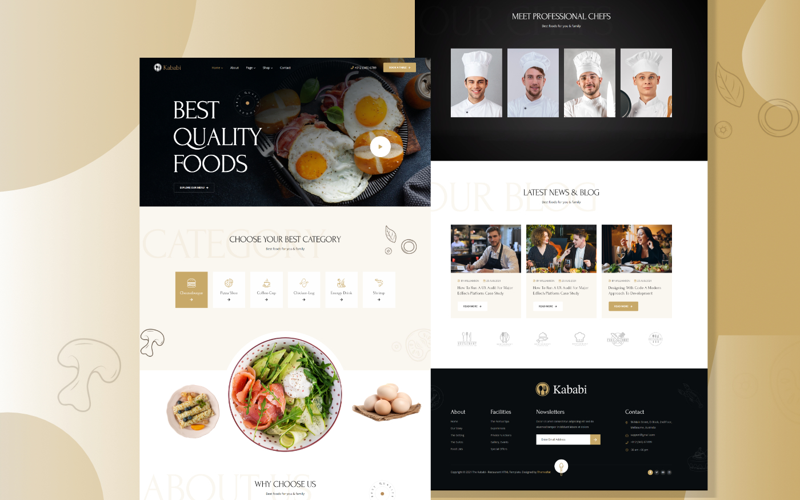

# Challenge: Kabibi food

| Challenge Parameters | Challenge Details                                           |
|:---------------------|:------------------------------------------------------------|
| Repository           | `Kababi-food`                                               |
| Challenge type       | `Consolidation`                                             |
| Duration             | `4 days`                                                    |
| Deadline             | `07/06/2023 16h00`                                          |
| Deployment method    | `GitHub pages`                                              |
| Group composition    | `Duos`                                                      |
| Submission Method    | [Github Classroom](https://classroom.github.com/a/kMR8HjA5) |

## Learning objectives

- Use SASS + B.E.M. Methodology,
- Write meaningful, semantically correct HTML.
- Usages of Sass (set up a theme together).
- Use modern positioning techniques using the grid or flexbox model and even absolute.
- Create a "pixel-perfect" integration from a given wireframe.
- Learn to read a Readme throughout.

A restaurant has reached out to you, and they want you to implement the design that already have prepared for you.

They already have prepared all images and resources for you, so all you have to do is use them.

Your team has a total of 3-4 days, with the power of flexbox, grid and positioning, you should be able to make it.

The restaurant had only one complaint about the design, in the _"try our special offer"_ the image is too close to the text. Move the image a bit more to the right so it looks nicer.

## What should you use and investigate? (feel free to explorer even further)

- B.E.M.
- SASS (scss)
- Semantic HTML
- Responsive [HTML images](https://developer.mozilla.org/en-US/docs/Learn/HTML/Multimedia_and_embedding/Responsive_images)
- Pixel perfection, what does it mean?
- When to use PX, REM, EM? 🤯
- Trello
- Sketching a website to understand it more
- Burger menu (possible without JavaScript)
- Correct use of multiple selectors
- CSS Grid
- CSS Flex-box
- SEO close to perfection

> ⚠️ Not using the above, will be marked as exercise failed.

Before starting this project, create a [trello board](https://trello.com/en) and organise the work. Try to organise as much as possible before beginning to code.

Try to break this project into components, so you can build block by block. Header and the footer are must haves.

Good luck!

## Bonus for the people done before the deadline

- Make hover animation
- Look for animation opportunities
- See if you can animate the content, as you scroll down and reset when we scroll up. (fade in, fade out? / parallax scrolling)
- Be creative! This would be something for your portfolio, make it perfect! clean it up, add new things.

